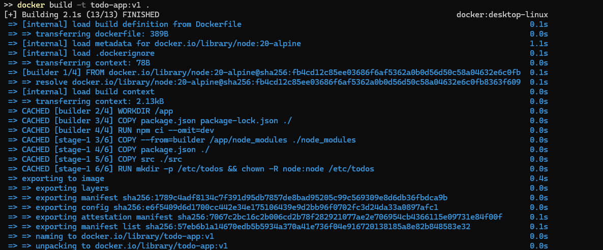
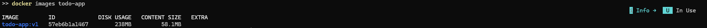
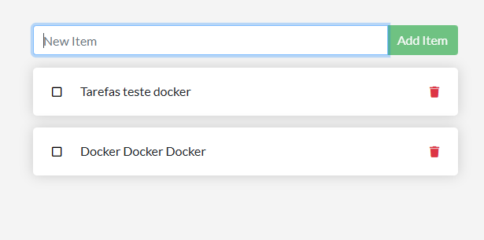
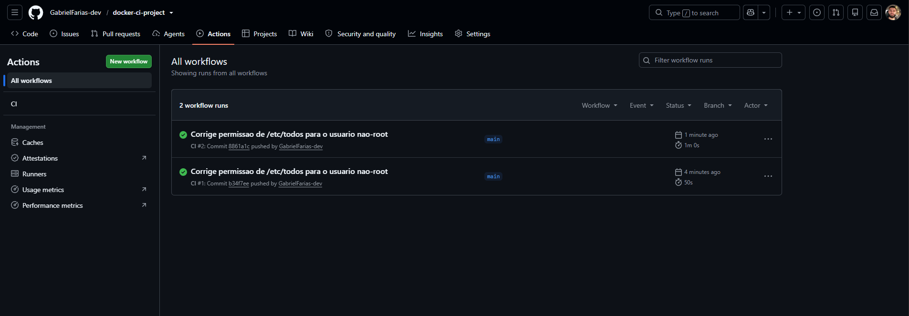
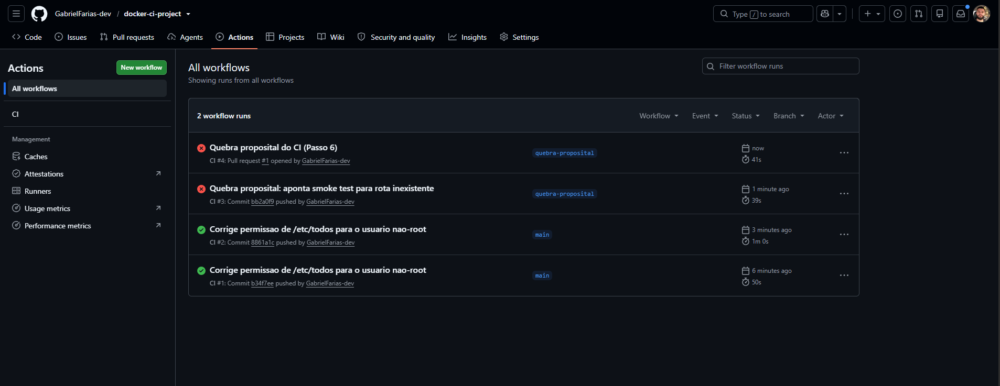
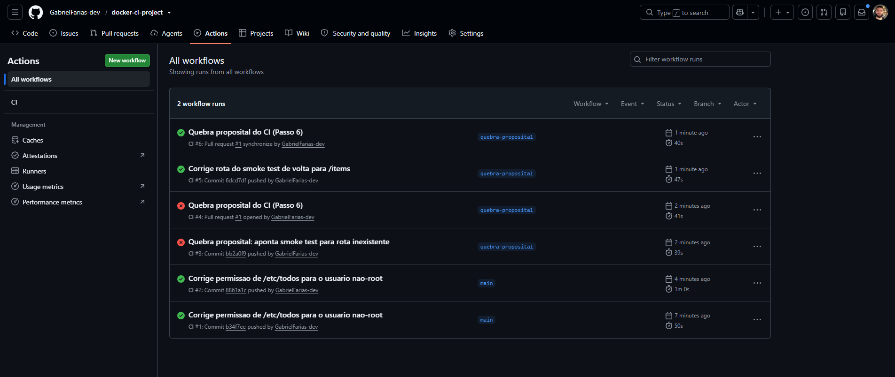

# Atividade Docker + CI — Gabriel Farias De Sousa

**Aluno(a):** Gabriel Farias De Sousa  **Turma:** Noturno  **Data:** 27/07/2026
**Aplicação usada:** docker/getting-started-app — To-Do em Node.js

## 1. Como executar este projeto
```bash
git clone git@github.com:GabrielFarias-dev/docker-ci-project.git
cd docker-ci-project
cp .env.example .env
docker compose up -d --build
```
Acesse: http://localhost:3000
Para derrubar: `docker compose down` (mantém dados) ou `docker compose down -v` (apaga dados).

## 2. Imagem e Dockerfile multi-stage
Estágios utilizados: `builder` (instala dependências com `npm ci`) e estágio final (copia apenas `node_modules` + `src`).
Imagem base: `node:20-alpine`
Usuário de execução: `node` (não-root)
Tamanho final da imagem: ~58,1 MB (conteúdo da imagem, via `docker images`)
Por que o multi-stage ajuda? Ele separa as ferramentas/dependências de build da imagem final, deixando-a menor e sem artefatos desnecessários (cache de instalação, devDependencies etc.).





Print 1 — build + docker images




Print 2 — aplicação rodando com tarefas cadastradas

## 3. Volumes e persistência
Volume usado: `todo-db` → montado em `/etc/todos`
Print 3 — SEM volume: dados perdidos ao recriar o container
Print 4 — COM volume: dados preservados
Diferença entre `docker compose down` e `docker compose down -v`: `down` remove containers e rede mas mantém os volumes nomeados (dados sobrevivem); `down -v` também remove os volumes, apagando os dados.

## 4. Rede
Rede criada: `todo-net`  Serviços conectados: app e db
A porta do banco está exposta ao host? Não — o banco só precisa ser acessado pelo serviço `app` dentro da rede interna do Compose, expô-lo ao host aumentaria a superfície de ataque sem necessidade.
Por que o app consegue chamar o host mysql/db sem saber o IP? Porque toda rede criada pelo Docker (ou pelo Compose) tem um DNS embutido que resolve o nome do serviço/container para o IP interno correto automaticamente.
Print 5 — docker network inspect
Print 6 — dados dentro do MySQL (select * from todo_items;)

## 5. Docker Compose
Serviços: `app`, `db`  Rede: `todo-net` · Volume: `todo-mysql-data`
Healthcheck em: `db` · depends_on com: `condition: service_healthy`
Variáveis sensíveis: carregadas via `.env` (não versionado). Modelo em `.env.example`.
Print 7 — docker compose ps

## 6. Integração Contínua (GitHub Actions)
Arquivo do workflow: `.github/workflows/ci.yml`  Gatilhos: `push` e `pull_request`
O que o pipeline faz: checkout do código, cria `.env` a partir do `.env.example`, valida e builda o compose, sobe a stack, aguarda a aplicação responder, roda um smoke test de CRUD (`POST` + `GET /items`), imprime logs em caso de falha e sempre derruba a stack (`down -v`) ao final.



Print 8 — execução verde

## 7. Quebra proposital do CI
O que eu quebrei: no PR [#1](https://github.com/GabrielFarias-dev/docker-ci-project/pull/1), troquei a rota do `GET` do smoke test de `/items` para `/items-inexistente` em `.github/workflows/ci.yml`.
Erro que apareceu no log: o `curl -sf` retornou 404 (silencioso, por causa do `-f`) e o shell (`set -e`) abortou o step com `Process completed with exit code 1`, antes mesmo de chegar no `grep`.
Como o CI reagiu: o step "Smoke test do CRUD" ficou vermelho, os steps seguintes de limpeza (`Derrubar a stack`) continuaram rodando por causa do `if: always()`.
Como eu corrigi: voltei a rota para `/items` na mesma branch (`quebra-proposital`), commitei e dei push — o CI rodou de novo e ficou verde.
Link do Pull Request: https://github.com/GabrielFarias-dev/docker-ci-project/pull/1



Print 9 — execução vermelha + log do erro



## 8. Dificuldades e aprendizados
A maior dificuldade foi rodar a imagem como usuário não-root: o processo falhava com `EACCES` ao tentar criar `/etc/todos`, porque esse diretório pertence ao root por padrão — resolvido criando a pasta e ajustando o dono (`chown`) para o usuário `node` ainda no Dockerfile, antes do `USER node`. Outro ponto de atenção foi o MySQL: passar `MYSQL_USER=root` para o container do banco faz o entrypoint oficial abortar (ele reserva esse env para o usuário do app, não para o root do banco), então esse env só pode ir para o serviço `app`. Também aprendi na prática a diferença entre `docker compose down` e `down -v`, e como o `healthcheck` + `depends_on: condition: service_healthy` evita a race condition clássica do app subindo antes do banco estar pronto.

## 9. Checklist de autoavaliação
- [x] Dockerfile multi-stage funcionando
- [x] .dockerignore presente
- [x] Container não roda como root
- [x] Volume nomeado + persistência demonstrada
- [x] Rede nomeada + banco não exposto ao host
- [x] compose.yaml sobe tudo com um comando
- [x] .env no .gitignore e .env.example versionado
- [x] CI verde
- [x] PR com CI vermelho documentado
- [ ] Todos os 9 prints no README
